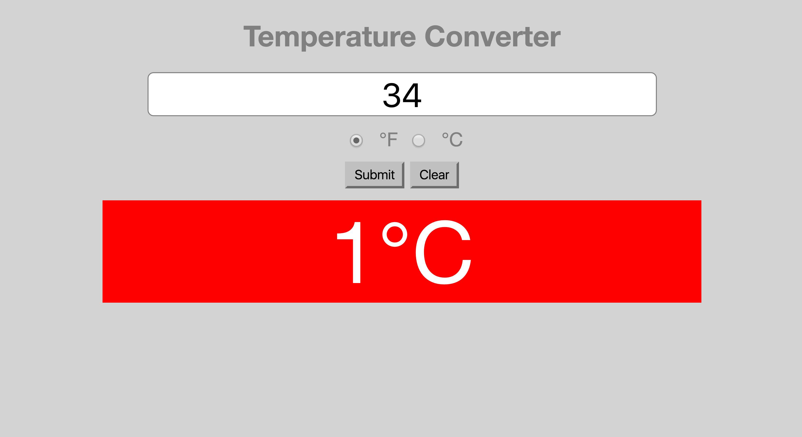

#Temperature Converter

We will be using JavaScript to make a temperature conversion utility. A folder is provided for you, with empty HTML and CSS files.

##Getting Started

* Fork and clone this repository
* Run `npm install` to install dependencies
  * `npm start` - start the BrowserSync server
  * `npm run lint:css` - lint CSS
  * `npm run lint:js` - lint JS

## Requirements
* Create a single page using HTML/CSS that contains an input field and a submit button, all within a form element.
* Additionally, add a clear button
* When the submit button is pressed, convert the inputted temperature from F to C using the appropriate conversion formula (may need to Google it)

##User Experience

1. User puts in a value into the text field
2. User clicks on button
3. The page gets updated with the converted temperature value.
4. Clicking a "Clear" button resets the text field

##Bonuses

1. Have the `div` turn **blue** for freezing temperatures, **red** for scorching temperatures.

2. Use a `dropdown` or `radio` buttons to select different units to convert (Fahrenheit to Celsius, or Celsius to Fahrenheit)

3. Place the `<input>` and `<button>` elements into a form, so that pressing ENTER will automatically convert the temperature. Note that there's an event type called `'submit'` that you can use instead of `'click'`.

4. Add your own personal sense of style using CSS styling and positioning techniques. Ideas include:
  * different fonts (see [Google Fonts](https://developers.google.com/fonts/docs/getting_started) for how to link fonts into a webpage)
  * images
  * colors
  * borders

##Deliverables

See the screenshot below for an example. Don't feel like you need to do it exactly the same though. Be creative with CSS!

---

## Licensing
1. All content is licensed under a CC-BY-NC-SA 4.0 license.
2. All software code is licensed under GNU GPLv3. For commercial use or alternative licensing, please contact legal@ga.co.
